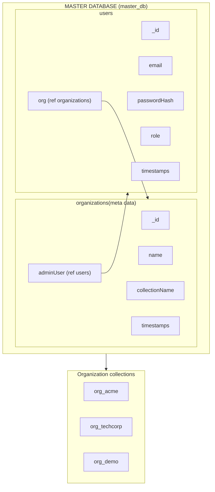
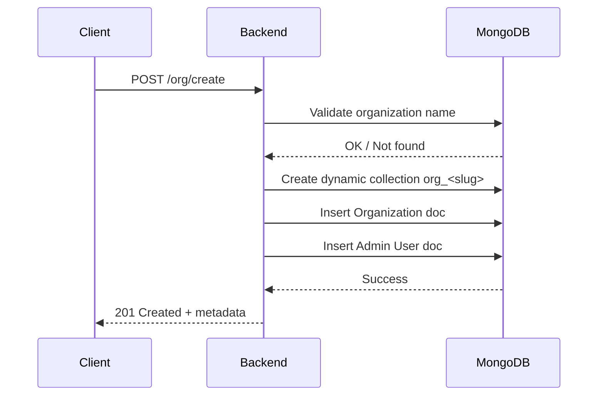
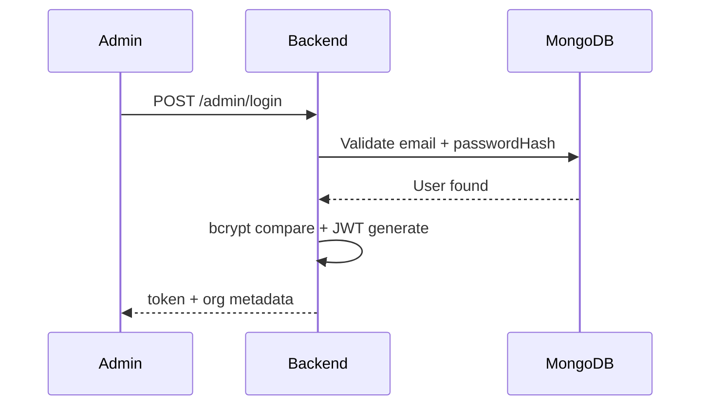

# Organization Management Service (Express + MongoDB)

Backend service implementing multi-tenant-style organizations with a Master Database and dynamic per-organization collections.

## Quick Start

1. Clone the repository

```powershell
git clone https://github.com/kenilsarang96/backend_task
cd backend_task
```

2. Install deps

```powershell
npm install
```
 create a `.env` file:

```
PORT=3000
MONGODB_URI=mongodb://127.0.0.1:27017/org_master
CORS_ORIGIN=http://localhost:3000
JWT_SECRET=your_jwt_secret_here
```

then:

```powershell
npm run start
```

## Data Storage Architecture



# Organization Creation Flow



# Admin Authentication Flow




## API Endpoints

### Organization Management (`/org`)

#### Create Organization
- **POST** `/org/create`
- Body:
```json
{
  "organization_name": "Acme",
  "email": "admin@acme.com",
  "password": "StrongPass!"
}
```
- Behavior:
  - Validates name uniqueness
  - Creates collection `org_acme`
  - Creates admin user (stored in Master DB) and links it
  - Stores org metadata in Master DB
  - Passwords are hashed with bcrypt

#### Get Organization by Name
- **GET** `/org/get?organization_name=Acme`
- Response: Organization metadata including admin user ref.

#### Update Organization
- **PUT** `/org/update`
- Body supports updating admin creds and optionally renaming org:
```json
{
  "organization_name": "Acme",
  "email": "new-admin@acme.com",
  "password": "NewStrongPass!",
  "new_organization_name": "AcmeNew"
}
```
- Behavior:
  - Updates admin email/password if provided
  - If `new_organization_name` provided and unique:
    - Creates new collection `org_acmenew`
    - Copies existing documents from old collection to new
    - Updates Master DB metadata

#### Delete Organization
- **DELETE** `/org/delete`
- Body or Query:
```json
{
  "organization_name": "Acme"
}
```
- **Authentication Required:** Bearer token
- Behavior:
  - Only the admin of the organization can delete it
  - Drops the org-specific collection
  - Deletes all users belonging to the org
  - Removes org metadata from Master DB

### Authentication (`/admin`)

#### Admin Login
- **POST** `/admin/login`
- Body:
```json
{
  "email": "admin@acme.com",
  "password": "StrongPass!"
}
```
- Response on success:
```json
{
  "message": "Login successful",
  "token": "eyJhbGciOiJIUzI1NiIsInR5cCI6IkpXVCJ9...",
  "user": {
    "id": "user_id",
    "email": "admin@acme.com",
    "role": "admin"
  },
  "organization": {
    "id": "org_id",
    "name": "Acme",
    "collectionName": "org_acme"
  }
}
```
- JWT token contains:
  - `userId`: Admin user ID
  - `email`: Admin email
  - `orgId`: Organization ID
  - `orgName`: Organization name
  - `role`: User role (admin)

#### Using JWT for Protected Routes
Include the token in the `Authorization` header:
```
Authorization: Bearer <token>
```

## Architecture

### Master Database
Stores:
- Organization metadata (`organizations` collection)
- Admin user credentials (`users` collection) - securely hashed with bcrypt
- Connection details for each organization's dynamic collection

### Dynamic Collection Creation
When an organization is created:
- Programmatically creates a new Mongo collection (e.g., `org_acme`)
- Collection is schemaless and can store organization-specific data
- Collection name follows pattern: `org_<slugified_name>`

### Authentication & Security
- JWT-based authentication using `jsonwebtoken`
- Passwords hashed with `bcryptjs` (10 rounds)
- Protected endpoints require Bearer token
- Role-based access control (admin-only operations)

